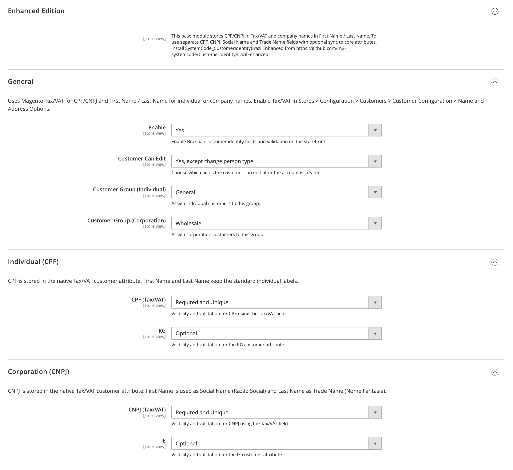
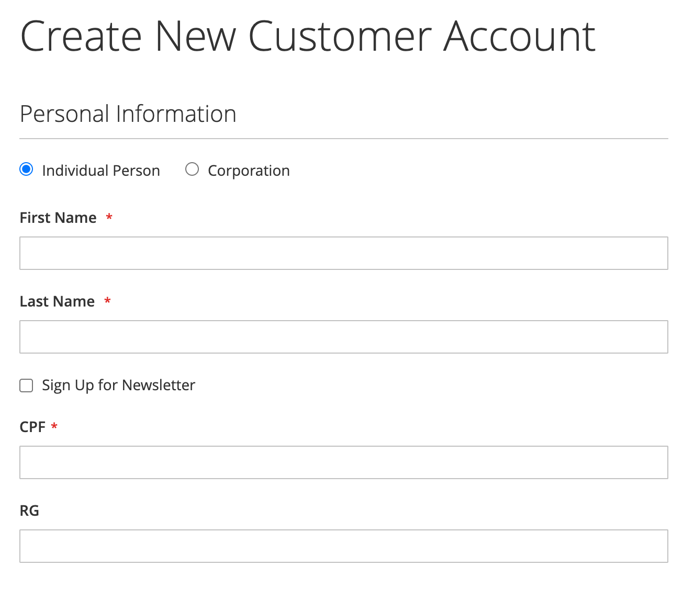
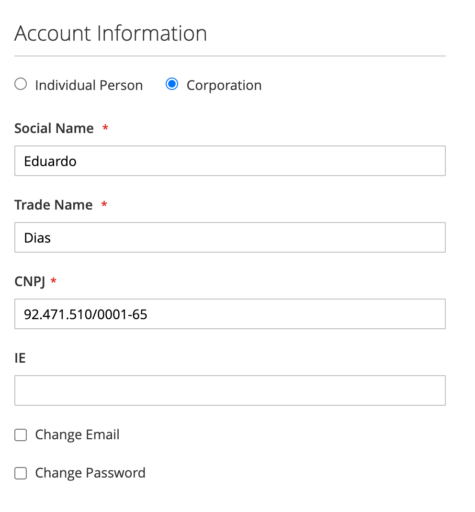
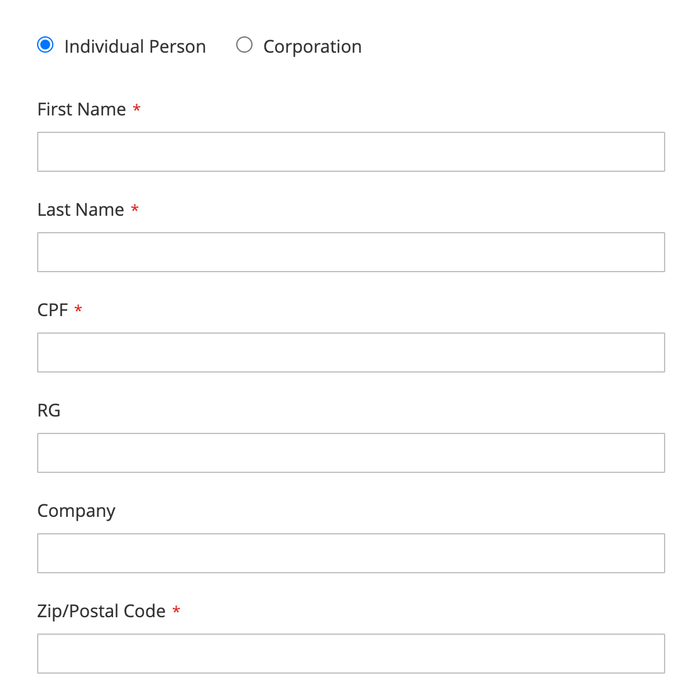

# System Code Brazil Customer Identity

## About Module

Brazilian customer identity for Magento using native Tax/VAT and name fields. Supports individual (CPF, RG) and corporation (CNPJ, IE) profiles, field visibility rules, customer group assignment, checkout integration, and address template guidance.

For dedicated CPF, CNPJ, Social Name, and Trade Name attributes, install [CustomerIdentityBrazilEnhanced](https://github.com/m2-systemcode/CustomerIdentityBrazilEnhanced).

### Configuration

**Stores > Configuration > System Code > Brazil Customer Identity**

Enable Tax/VAT under **Stores > Configuration > Customers > Customer Configuration > Name and Address Options**.

### Screenshots

#### Admin Configuration


#### Customer Registration


#### My Account — Edit Profile


#### Checkout


### Requirements

- `systemcode/base`
- `systemcode/customer`
- `magento/module-customer`
- `magento/module-checkout`

### How to install

#### ✓ Install by Composer (recommended)
```
composer require systemcode/base systemcode/customer systemcode/customer-identity-brazil
php bin/magento module:enable SystemCode_CustomerIdentityBrazil
php bin/magento setup:upgrade
```

#### ✓ Install Manually
- Copy module to folder `app/code/SystemCode/CustomerIdentityBrazil` and run commands:
```
php bin/magento module:enable SystemCode_CustomerIdentityBrazil
php bin/magento setup:di:compile
php bin/magento setup:upgrade
```

### License
OSL-3.0

### Authors
* [Eduardo Diogo Dias](https://github.com/eduardoddias)


---


## Sobre o Módulo

Identidade de cliente brasileira para Magento usando os campos nativos Tax/VAT e nome. Suporta pessoa física (CPF, RG) e jurídica (CNPJ, IE), regras de visibilidade, atribuição de grupo de cliente, integração com checkout e orientações para modelos de endereço.

Para atributos dedicados de CPF, CNPJ, Razão Social e Nome Fantasia, instale o [CustomerIdentityBrazilEnhanced](https://github.com/m2-systemcode/CustomerIdentityBrazilEnhanced).

### Configuração

**Lojas > Configuração > System Code > Brazil Customer Identity**

Ative Tax/VAT em **Lojas > Configuração > Clientes > Configuração de Cliente > Opções de Nome e Endereço**.

### Screenshots

#### Configuração no Admin


#### Cadastro de Cliente


#### Minha Conta — Editar Perfil


#### Checkout


### Requisitos

- `systemcode/base`
- `systemcode/customer`
- `magento/module-customer`
- `magento/module-checkout`

### Como Instalar

#### ✓ Instalação via Composer (recomendado)
```
composer require systemcode/base systemcode/customer systemcode/customer-identity-brazil
php bin/magento module:enable SystemCode_CustomerIdentityBrazil
php bin/magento setup:upgrade
```

#### ✓ Instalação Manual
- Copie o módulo para `app/code/SystemCode/CustomerIdentityBrazil` e execute:
```
php bin/magento module:enable SystemCode_CustomerIdentityBrazil
php bin/magento setup:di:compile
php bin/magento setup:upgrade
```

### Licença
OSL-3.0

### Autores
* [Eduardo Diogo Dias](https://github.com/eduardoddias)
